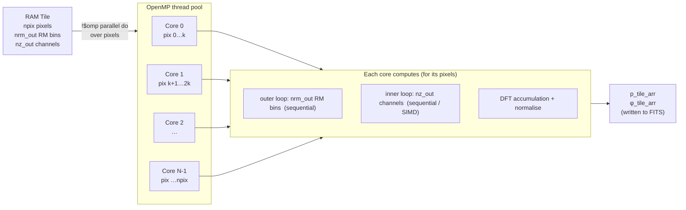
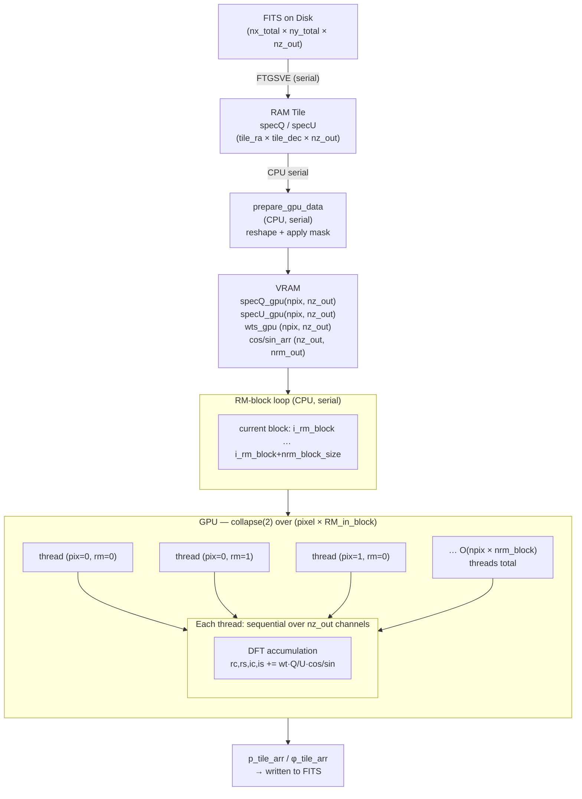
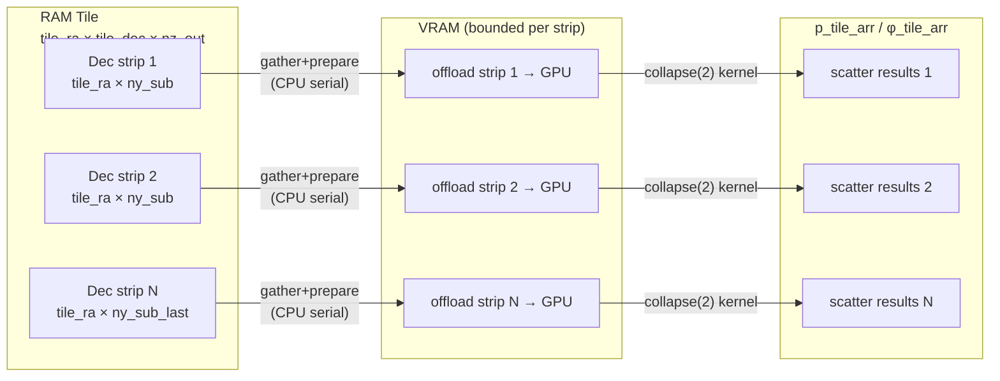

# RM-Synthesis Parallelism and Memory Architecture

This document describes how `rm_synthesis` tiles the sky image, loads it into
RAM/VRAM, and distributes work across CPU cores or GPU threads.

---

## 1 — Serial FITS Load into RAM (Tiled I/O)

The full sky image is too large to hold in RAM at once (e.g. 25k×25k×236
channels). The code reads it in **spatial tiles** chosen to fit within a
user-controlled fraction of available RAM (`mem_frac_ram`).

```
DISK  ─────────────────────────────────────────────────────────────────────────
  Q.FITS  [nx_total × ny_total × nz_out]   (e.g. 25600 × 25600 × 236 ch)
  U.FITS  [nx_total × ny_total × nz_out]
            │
            │  FTGSVE  (CFITSIO strided sub-image read)  ← serial, one tile
            ▼
RAM  ──────────────────────────────────────────────────────────────────────────
  specQ  [tile_ra × tile_dec × nz_out]     flat float32 array
  specU  [tile_ra × tile_dec × nz_out]     flat float32 array
  mask_tile_arr [tile_ra × tile_dec × nz_out]  int8, built in single pass:
        ├─ global bad channels  (flag_arr_out)
        ├─ NaN/Inf in Q or U
        └─ input mask FITS       (if provided)
```

The outer loops over tiles are **purely serial** — tiles are processed one at a
time, each written back to the output FITS before the next tile is read:

```
for ix_tile = xpix_beg … xpix_end  step tile_ra          ← serial
  for iy_tile = ypix_beg … ypix_end  step tile_dec        ← serial
    FTGSVE → specQ, specU                                  ← serial disk read
    build mask_tile_arr                                    ← serial single pass
    extract P(RM, pixel)  [CPU or GPU — see §2/§3]
    FTPSSE → output FITS                                   ← serial disk write
```

---

## 2 — CPU Parallelism

The CPU kernel (`tile_extract_gpu`) parallelises over **pixels** using OpenMP.
Each core independently computes the full RM spectrum for its assigned pixels.

```
RAM tile:  specQ(npix, nz_out)   npix = tile_ra × tile_dec
           specU(npix, nz_out)
           mask_tile_arr(npix, nz_out)
           cos_arr(nz_out, nrm_out)   ← read-only, shared by all cores
           sin_arr(nz_out, nrm_out)   ← read-only, shared by all cores

  !$omp parallel do  (over ipix = 1 … npix)
  OpenMP divides npix into N contiguous chunks, one per core:

  ipix:  1 ──── chunk ────► npix/N │ npix/N+1 ──── chunk ────► 2*npix/N │ …
         └──── Core 0 ────┘         └──────── Core 1 ──────┘

  ┌──────────────────────────────────────────────────────────────────┐
  │  Core 0          │ Core 1          │ Core 2    │ … │ Core N-1   │
  │  pix 1…npix/N    │ pix npix/N+1…  │ …         │   │ …npix      │
  │                  │   2*npix/N      │           │   │            │
  │                                                                  │
  │  Each core, for its pixel ipix:                                  │
  │    for i_rm = 1 … nrm_out          (sequential)                 │
  │      for cnt2 = 1 … nz_out         (sequential, SIMD eligible)  │
  │        rc += wt * Q[cnt2] * cos_arr[cnt2, i_rm]                 │
  │        rs += wt * Q[cnt2] * sin_arr[cnt2, i_rm]                 │
  │        ic += wt * U[cnt2] * cos_arr[cnt2, i_rm]                 │
  │        is += wt * U[cnt2] * sin_arr[cnt2, i_rm]                 │
  │      P[ipix, i_rm] = sqrt((rc-is)²+(rs+ic)²) / wsum            │
  │  !$omp end parallel do                                           │
  └──────────────────────────────────────────────────────────────────┘

Output:  p_tile_arr   [npix × nrm_out]  flat float32
         phi_tile_arr [npix × nrm_out]  flat float32
```

**Work partition:**



---

## 3 — GPU Parallelism

The GPU kernel (`tile_extract_gpu_rm_blocked`) parallelises over **pixel × RM**
pairs using `collapse(2)`. The channel loop remains sequential per work-item.

### 3a — Single-level (tile fits in VRAM)

```
RAM tile  →  prepare_gpu_data  →  specQ_gpu(npix, nz_out)   float32
                                   specU_gpu(npix, nz_out)   float32
                                   wts_gpu  (npix, nz_out)   float32  (0/1)

Templates (read-only, stays on device across RM blocks):
  cos_arr(nz_out, nrm_out)
  sin_arr(nz_out, nrm_out)

RM-block loop  (CPU, serial):
  for i_rm_block = 1 … nrm_out  step nrm_block_size
    ┌────────────────────────────────────────────────────────────────────┐
    │  !$omp target teams distribute parallel do  collapse(2)           │
    │  [offloaded to GPU; falls back to CPU threads if no GPU]          │
    │                                                                    │
    │  for ipix      = 1 … npix           ┐                             │
    │  for i_rm_loc  = 1 … nrm_block_now  ┘  collapsed → GPU threads   │
    │                                                                    │
    │    Each GPU thread (one per pixel×RM pair):                        │
    │      i_rm_global = i_rm_block + i_rm_loc - 1                      │
    │      for iz = 1 … nz_out          (sequential)                    │
    │        wt = wts_gpu[ipix, iz]                                      │
    │        rc += wt*(Q[ipix,iz]-μQ) * cos_arr[iz, i_rm_global]        │
    │        rs += wt*(Q[ipix,iz]-μQ) * sin_arr[iz, i_rm_global]        │
    │        ic += wt*(U[ipix,iz]-μU) * cos_arr[iz, i_rm_global]        │
    │        is += wt*(U[ipix,iz]-μU) * sin_arr[iz, i_rm_global]        │
    │      P[ipix, i_rm_global] = sqrt(…) / wsum                        │
    │  !$omp end target …                                                │
    └────────────────────────────────────────────────────────────────────┘
```



### 3b — Two-level staging (tile too large for VRAM)

When the RAM tile does not fit in VRAM, it is further subdivided into **Dec
strips** (`ny_sub` rows). Each strip is gathered into compact staging buffers,
offloaded, and results scattered back.

```
RAM tile  [tile_ra × tile_dec × nz_out]
  │
  │  for iy_sub_beg = 1 … tile_dec  step ny_sub    ← serial, CPU
  │
  ├──► gather:  stQ/stU/stMask_tile_arr  [tile_ra × ny_sub_now × nz_out]
  │
  ├──► prepare_gpu_data  →  st_Q_gpu / st_U_gpu / st_wts_gpu
  │
  ├──► RM-block loop  →  tile_extract_gpu_rm_blocked  (same as §3a)
  │       GPU parallelism: (tile_ra × ny_sub_now) × nrm_block_size threads
  │
  └──► scatter:  stP / stPhi  back into  p_tile_arr / phi_tile_arr
```



---

## 4 — Summary: Parallelism Dimensions

| Dimension | CPU path | GPU path |
|---|---|---|
| **Tiles (RA × Dec)** | serial | serial |
| **Pixels within tile** | `!$omp parallel do` — N_cores threads | `collapse(2)` — O(npix × nrm_block) GPU threads |
| **RM bins** | sequential per core | batched per block; collapsed into pixel dimension |
| **Channels (nz_out)** | sequential (SIMD by compiler) | sequential per GPU thread |
| **VRAM staging** | N/A | serial Dec-strip loop when tile > VRAM |

**Key invariant:** `cos_arr` and `sin_arr` are pre-computed once, held
resident in RAM (CPU) or VRAM (GPU), and never recomputed per-pixel or
per-RM-block.
