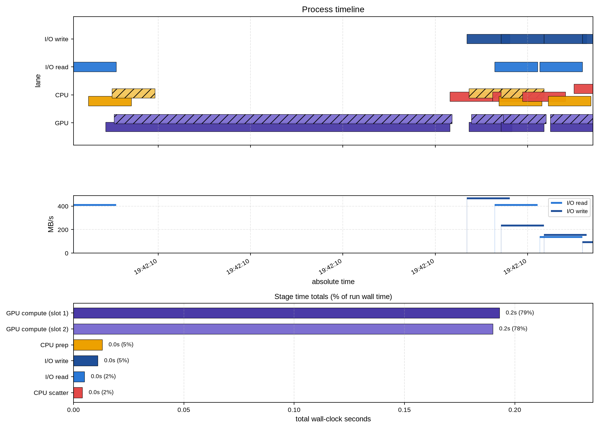
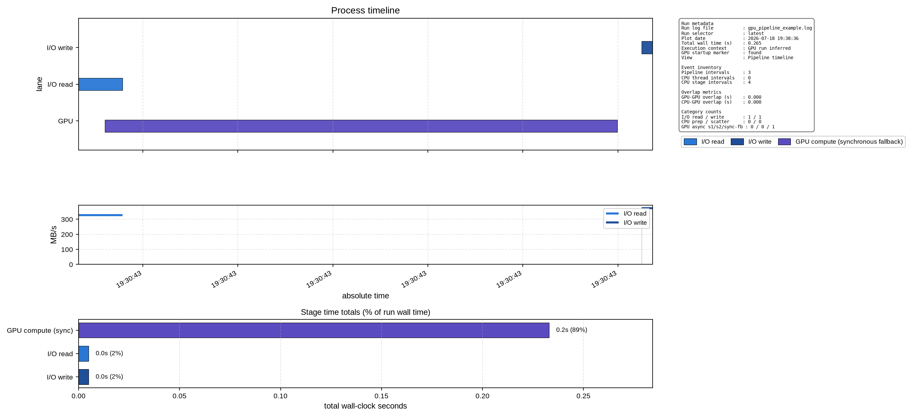
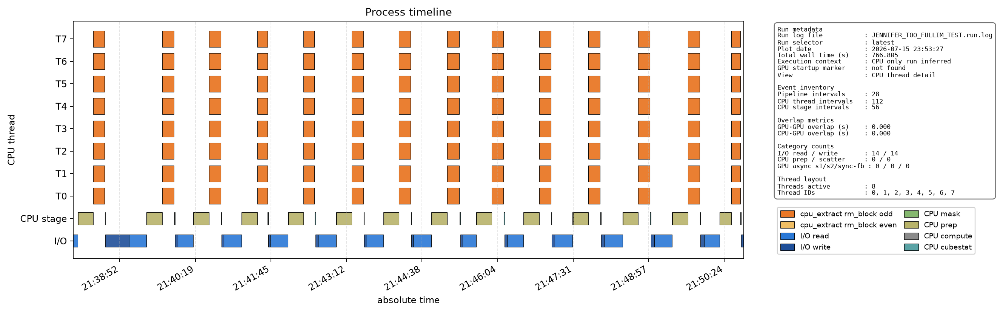

# rmtool


An HPC package for conducting Faraday Tomography (RM-Synthesis) on radio spectro-polarimetric data. The package is built for all machines - scaling from Low-RAM Desktop PCs to HPC Clusters, with GPU acceleration integration underway.

## Features

- **Config-driven RM synthesis** — Use flexible KEY=VALUE configuration files
- **Subimage support** — Extract and process spatial/spectral subsets via config parameters
- **FITS I/O** — Native support for FITS format using CFITSIO
- **GPU offload toggle** — Enable OpenMP target offload with `use_gpu=y` in config
- **Dual build systems** — Makefile for development, CMake for distribution
- **Fortran 77/90** — High-performance numerical code

## Quick Start

### Prerequisites

- **gfortran** (Fortran compiler)
- **CFITSIO** library (`libcfitsio-dev` on Debian/Ubuntu)
- **GNU Make** or CMake

### Build

```bash
# Simple Makefile build (recommended)
make

# Run executable
./bin/rm_synthesis cfg/your_config.cfg
```

Common explicit build variants:

| Build command | Binary produced |
|---|---|
| `make OMP=0 GPU=0` | `bin/rm_synthesis_release_cpu_serial` |
| `make OMP=1 GPU=0` | `bin/rm_synthesis_release_cpu_omp` |
| `make OMP=0 GPU=1` | `bin/rm_synthesis_release_gpu_offload` |
| `make OMP=1 GPU=1` | `bin/rm_synthesis_release_gpu_offload_hostomp` |

The build commands are unchanged; only the binary naming is now clearer.

See [QUICKSTART.md](QUICKSTART.md) for detailed build instructions.

## Documentation

- **[QUICKSTART.md](QUICKSTART.md)** — Quick reference and build overview
- **[BUILD.md](BUILD.md)** — Comprehensive build system documentation
- **[cfg/CONFIG_README.md](cfg/CONFIG_README.md)** — Configuration file reference
- **[docs/ARCHITECTURE.md](docs/ARCHITECTURE.md)** — Master architecture document for implemented codebase design
- **[docs/PARALLELISM.md](docs/PARALLELISM.md)** — Parallelism and memory decomposition deep-dive
- **[docs/DESIGN_CPU_GPU_TIMELINE_AND_RM_BLOCKING.md](docs/DESIGN_CPU_GPU_TIMELINE_AND_RM_BLOCKING.md)** — Architecture rationale: tiling, RM chunking, CPU/GPU parallelization, offload strategy
- **[planning/IO_PARALLEL_OPTIMISATION_PLAN.md](planning/IO_PARALLEL_OPTIMISATION_PLAN.md)** — IO optimisation plan: parallel read/write and async overlap (T0-T5 adopted; T6, genuine write-throughput parallelism, still a proposal)
- **[CHANGELOG.md](CHANGELOG.md)** — Release history and key changes by version
- **[docs/RELEASE_NOTES_2.0.md](docs/RELEASE_NOTES_2.0.md)** — Detailed release notes for tag 2.0
- **[docs/RELEASE_NOTES_3.0.md](docs/RELEASE_NOTES_3.0.md)** — Draft release notes for the anticipated 3.0 (IO-efficiency milestone, in progress)

## Configuration

RM synthesis is controlled via configuration files in the `cfg/` directory. Every configuration must provide required KEY=VALUE pairs for input/output paths, processing parameters, and RM sampling.

**Example:**

```cfg
# Paths and files
path = /path/to/data/
infileQ = Q_cube.fits
infileU = U_cube.fits
outfile = my_rm_synthesis

# RM sampling (linear grid from beg_rm to end_rm with nrm points)
beg_rm = -500
end_rm = 500
nrm = 101
use_auto_rm_range = 0      # 0=manual range, 1=auto from data
ofac = 4                    # Oversampling factor
fac = 3.14159265358979      # Pi for lambda^2 calculations

# Processing options
remove_badchan = n          # Remove channels with RFI (y/n)
badchan_file = unused.txt   # File listing bad channels
rem_mean = 0                # Remove mean Q/U (0 or 1)
remove_qu_bias = n          # Remove I-based bias from Q/U (y/n)
use_gpu = n                 # GPU offload request (y/n). Alias: use_gpus
output_mode = ap            # Output format: ap (amp+phase) or ri (real+imag)
ap_angle_mode = phase       # Phase mode: phase (arg) or pol (0.5*arg)

# Residuals for bias correction
resiQ = 0.0
slopeQ = 0.0
resiU = 0.0
slopeU = 0.0

# Subimage extraction (optional)
subim = y
subim_ra_blc = 1            # RA first pixel
subim_ra_trc = 256          # RA last pixel (0 = max)
subim_ra_inc = 1            # RA step
subim_dec_blc = 1           # Dec first pixel
subim_dec_trc = 256         # Dec last pixel (0 = max)
subim_dec_inc = 1           # Dec step
subim_chan_blc = 1          # Channel first (0 = first)
subim_chan_trc = 0          # Channel last (0 = all)
subim_chan_inc = 1          # Channel step

# Bias correction inputs (required if remove_qu_bias = y)
path_I = /path/to/data/
infileI = I_cube.fits
```

For complete documentation, see [cfg/CONFIG_README.md](cfg/CONFIG_README.md).

## Timing And Benchmark CSV Output

The runtime logger can emit a human-readable timing summary and an optional CSV
row for automation/benchmark tracking.

Add these keys to your config:

```cfg
# Optional timing controls
log_level = info                  # error|warn|info|debug
timing_enabled = y                # master timing switch
timing_tile_enabled = y           # include tile-level stage timers
timing_io_enabled = y             # include I/O stage timers
log_output_file =                 # empty => stdout, else append to file
timing_csv_file = ./timing.csv    # optional: append one CSV row per run
```

Logging behaviour:
- `log_level` controls structured log lines emitted via `log_message`.
	- `error`: errors only
	- `warn`: warnings + errors
	- `info`: run lifecycle messages (recommended default)
	- `debug`: reserved for future verbose diagnostics
- `log_output_file` controls destination for both structured log lines and
	timing summary blocks.
	- empty: output goes to stdout
	- non-empty: output is appended to one consolidated run log file
	- every emitted line in this consolidated log is ISO-8601 timestamped

The consolidated log file includes ISO-8601 local timestamps on structured log
entries, for example:

```text
2026-07-12T14:03:09+10:00 [info] [startup] rm_synthesis run started
2026-07-12T14:03:09+10:00 [info] [startup] binary_flavor=gpu_offload
...
2026-07-12T14:03:11+10:00 [info] [finalize] rm_synthesis run completed
```

When enabled, the run prints:
- `Run summary:` (binary flavor and GPU requested/active state)
- `Timing summary (seconds):` (stage totals and percentages)
- `Macro timing breakdown:` (read I/O, compute RM, compute cubestat, write I/O, overhead)

The optional CSV output writes a header (once) and one row per run with:
- run id and mode
- cube and tile dimensions
- stage timings
- process-level I/O counters

Example run:

```bash
bin/rm_synthesis_release_cpu_serial cfg/rmsynth.cfg
```

Example GPU run:

```bash
bin/rm_synthesis_release_gpu_offload cfg/rmsynth.cfg
```

## Tile Memory Planning and I/O Parallelism

For cubes too large to fit in RAM, the image is auto-tiled into full-RA
Dec strips sized to a fraction of system RAM, with optional parallel
reads/writes and background-thread write overlap. All of these are opt-in
and default to the pre-existing serial behaviour.

```cfg
# Tile memory planning
tile_auto = y                # y: auto-size tiles from mem_frac_ram (recommended)
tile_ra = 0                  # manual override (0 = auto); ignored when tile_auto=y
tile_dec = 0                 # manual override (0 = auto); ignored when tile_auto=y
mem_frac_ram = 0.30          # fraction of total system RAM to budget per tile
mem_frac_vram = 0.70         # fraction of GPU VRAM to budget per sub-block (GPU only)

# I/O parallelism
io_read_threads = 4          # N independent read-only FITS handles per input
                              # cube, each reading a disjoint channel range.
                              # Safe to increase (try your Lustre stripe count).
io_write_threads = 1         # DO NOT SET ABOVE 1 -- see warning below.
io_overlap = n               # y: overlap tile N's write with tile N+1's
                              # read/mask/prep/compute on a background thread.
```

**`io_write_threads` must stay at `1`.** Setting it higher used to open
multiple read-write handles onto the same output file for parallel
RM-chunked writes, but CFITSIO aliases repeat read-write opens of an
already-open file onto one shared internal buffer — the "independent"
handles aren't independent, and concurrent writes through them corrupted
that shared state badly enough to crash with a segfault on a real run.
The code now hard-clamps `io_write_threads_eff` to `1` and prints a
warning if you request more, so this is safe to leave in a config file,
but there is currently no way to get a working speed-up from this key.
See `docs/ARCHITECTURE.md` ("Parallel write — `io_write_threads`") for the
full root cause.

**`io_overlap`'s writes are fully serialized against each other, by
design.** Every tile's write shares the same single output handle (see
above), so `io_overlap` guarantees at most one write is ever in flight —
enforced with a blocking `pthread_join()` before dispatching the next
one, not a timing-dependent assumption. (An earlier version of this
feature only checked this per double-buffer slot, which left a gap: a
small/fast tile immediately after a large/slow one — e.g. the leftover
partial tile at the bottom of an image whose height isn't an exact
multiple of the tile size — could dispatch its write before the previous
tile's write had finished, corrupting CFITSIO's shared handle state.
Fixed and re-validated end-to-end on the exact case that crashed; see the
T5 postmortem in `docs/ARCHITECTURE.md` / `planning/IO_PARALLEL_OPTIMISATION_PLAN.md`.)
This doesn't reduce the actual overlap benefit — tile N+1's
read/mask/prep/compute/cubestat already run fully concurrently with
write(N) regardless; only *dispatch* of write(N+1) waits for write(N)'s
handle to free up, which write(N) has almost always already done by then.

**`io_overlap` is not a free win — check your RAM and disk before turning
it on.** It doubles the RAM used by the per-tile output buffers (to let a
background thread write tile N while tile N+1 is computed), and the
benefit depends entirely on how much of your wall time is actually spent
waiting on I/O:

| | Fast disk | Slow disk |
|---|---|---|
| **Small RAM** | Likely **worse**: doubled buffers shrink tiles a lot (more per-tile overhead), fast disk means little write time to hide anyway. | Depends: helps on parallel storage (Lustre/NFS); likely **worse** on a single physical drive (concurrent read+write causes seek-thrashing instead of hiding latency). |
| **Large RAM** | Harmless but pointless: tile count barely changes, but there's little I/O time to hide either. | Best case — this is what the feature targets. |

Rule of thumb: if you're RAM-constrained *and* not on a parallel
filesystem (Lustre, multi-server NFS, cloud block storage), leave
`io_overlap=n`. Full reasoning in `docs/ARCHITECTURE.md` under "When
`io_overlap=y` can be detrimental" — when in doubt, time a short run both
ways on your actual target machine; the swim-lane plotter (below) renders
I/O read and I/O write as separate lanes specifically to make this cheap
to check.

## Recent Performance Enhancements

Recent updates improved host-side parallelism around staging and data packing:

- In `src/rm_synthesis.f90`, staged gather/scatter loops now use host OpenMP
  loop parallelism (`parallel do` / `taskloop`) within the existing async-slot
  dependency framework.
- In `src/rm_synthesis_mod.f90`, pack/copy loops in `prepare_cpu_data` and
  `prepare_gpu_data` are host-parallelised in HOST_OMP builds with an
  `omp_in_parallel` guard to prevent nested-region oversubscription.
- In `src/rm_synthesis.f90`, tile-memory planning now separates:
	- RAM tile budget (`bytes_per_tile_pixel_ram`) for host read-tile sizing, and
	- VRAM sub-block budget (`bytes_per_vram_pixel`) for GPU staging/offload sizing.
	This decouples host tile size from device strip size and avoids
	over-conservative RAM tiling in CPU or non-staging runs.

Scope note:
- The staged gather/scatter enhancement is active only when `use_staging=true`
	(GPU-active staging path). CPU-only non-staging runs do not execute those
	staged loops.

Session validation summary:
- Build matrix: all four `OMP/GPU` variants compile successfully.
- Tests: `22/22` passing.
- Jennifer full-image benchmark (new planner split):
	- CPU run improved from `733.758s` to `721.764s`.
	- GPU run completed successfully with active offload, but was slightly slower
		in this environment (`2110.988s` -> `2133.811s`, about `+1.1%`).

## GPU Acceleration

rmtool supports OpenMP target offload builds for GPU execution.

Build and run:

```bash
# Build GPU/offload-capable binary
make GPU=1

# Run with a GPU-enabled config (use_gpu=y in cfg/rmsynth.cfg)
bin/rm_synthesis_release_gpu_offload_hostomp cfg/rmsynth.cfg
```

Useful runtime environment variables:

```bash
OMP_TARGET_OFFLOAD=MANDATORY   # fail if offload cannot run
OMP_DEFAULT_DEVICE=0           # choose target device index
```

## Swim-Lane Plot Generation

Use the swim-lane script to visualize overlap between I/O, CPU staging, and GPU
compute from a consolidated run log.

Generate a plot from a run log:

```bash
python scripts/plot_tile_async_swimlane.py \
	--log scratch/RMSYNTH_OUTPUT.run.log \
	--out scratch/tile_async_swimlane.png \
	--run latest \
	--time-axis absolute
```

Key options:

- `--run latest|first|N` selects which detected run block from the log to plot.
- `--time-axis absolute|relative` chooses wall-clock vs seconds-from-run-start.
- `--out` controls output PNG path.

The script also prints summary metrics (interval count, window seconds,
GPU-GPU overlap, CPU-GPU overlap) to stdout.

Every plot now includes a **stage time totals** bar panel underneath the
timeline: total wall-clock seconds per stage, sorted largest-first, with
seconds and % of total run wall time labelled on each bar. A bar chart
rather than a pie, since real runs are often extremely skewed (one stage
at >90% of wall time) -- a pie would render that as one slice and an
unreadable sliver soup. Percentages can add up to more than 100%; that's
expected when stages overlap in wall time (e.g. `io_overlap=y`), not a
bug. The side panel's `Thread IDs` line (CPU thread detail view) was
dropped in favour of just `Threads active` (a count) -- the full ID list
stopped being useful information once thread counts got into the teens.

Design rationale and diagnostic interpretation notes are documented in
[docs/DESIGN_CPU_GPU_TIMELINE_AND_RM_BLOCKING.md](docs/DESIGN_CPU_GPU_TIMELINE_AND_RM_BLOCKING.md).

Example swim-lane plots (predate the stage-totals panel and thread-ID
simplification above; illustrative of lane layout only):

Pipeline/stage-overlap view (long-run async example):



Pipeline/stage-overlap view (sync-fallback/smaller-run example):



CPU thread-detail view:



### GPU Validation Scope For Swim-Lane Diagnostics

- Tested on: `NVIDIA GeForce RTX 3050 (6 GiB VRAM)` with GNU OpenMP offload
	(`nvptx`) in this repository's current workflow.
- Not yet validated: AMD ROCm offload targets, Intel GPU offload targets, and
	very old NVIDIA GPUs/toolchains where OpenMP target offload support differs.
- If your platform is unvalidated, treat swim-lane diagnostics as experimental
	and confirm with a short controlled run before production execution.

## GPU Runtime Behaviour

- `use_gpu=n` runs host execution.
- `use_gpu=y` requests GPU execution when running a GPU-capable binary (`make GPU=1`).
- If `use_gpu=y` is used with a CPU-only binary, the run prints a warning and falls back to CPU.

Useful runtime env vars for GPU runs:

```bash
OMP_TARGET_OFFLOAD=MANDATORY   # fail if offload cannot run
OMP_DEFAULT_DEVICE=0           # choose target device
```

Build examples:

```bash
# CPU-only OpenMP binary
make GPU=0 OMP=1

# GPU/offload-capable binary
make GPU=1
```

**Output Files:**
- `AP + phase mode`: `OUTBASE.AMP.RMCUBE.FITS` and `OUTBASE.PHA.RMCUBE.FITS`
- `AP + pol mode`: `OUTBASE.AMP.RMCUBE.FITS` and `OUTBASE.POLA.RMCUBE.FITS`
- `RI mode`: `OUTBASE.REAL.RMCUBE.FITS` and `OUTBASE.IMAG.RMCUBE.FITS`
- `Common diagnostics`: `OUTBASE.NVALID.MAP.FITS` (valid-channel count map)
- `When cubestat=y`:
	- `OUTBASE.PEAK.MAP.FITS`
	- `OUTBASE.RM_PEAK.MAP.FITS`
	- `OUTBASE.ANG_PEAK.MAP.FITS`
	- `OUTBASE.SNR.MAP.FITS`

## Project Structure

```
rmtool/
├── src/                  Source code (Fortran 77/90)
│   ├── rm_synthesis.f90  Main program
│   ├── rm_synthesis_mod.f90  Config parser module
│   └── legacy/           Legacy tools
├── cfg/                  Configuration files and examples
├── bin/                  Compiled executables
├── build/                Build artifacts (Makefile)
├── Makefile              Build configuration
├── CMakeLists.txt        CMake build configuration
└── BUILD.md              Build documentation
```

## Development

### Branch Structure

- **main** — Stable, production-ready releases
- **develop** — Active development branch

### Release Tags

- Formal release tags use `MAJOR.MINOR` format (for example: `1.0`, `1.1`, `2.0`).
- The first formal release tag is `1.0` on `main`.
- Milestone-style tags can still exist for internal checkpoints, but official releases use the numeric format above.

### Building

```bash
# Makefile (development)
make              # Build release
make MODE=debug   # Build with symbols
make clean        # Clean artifacts

# CMake (distribution)
./cmake_build.sh
cd build_cmake && sudo cmake --install .
```

## License

See [LICENSE](LICENSE) file for details.

## Contact

For questions or contributions, please open an issue or contact the maintainers.
