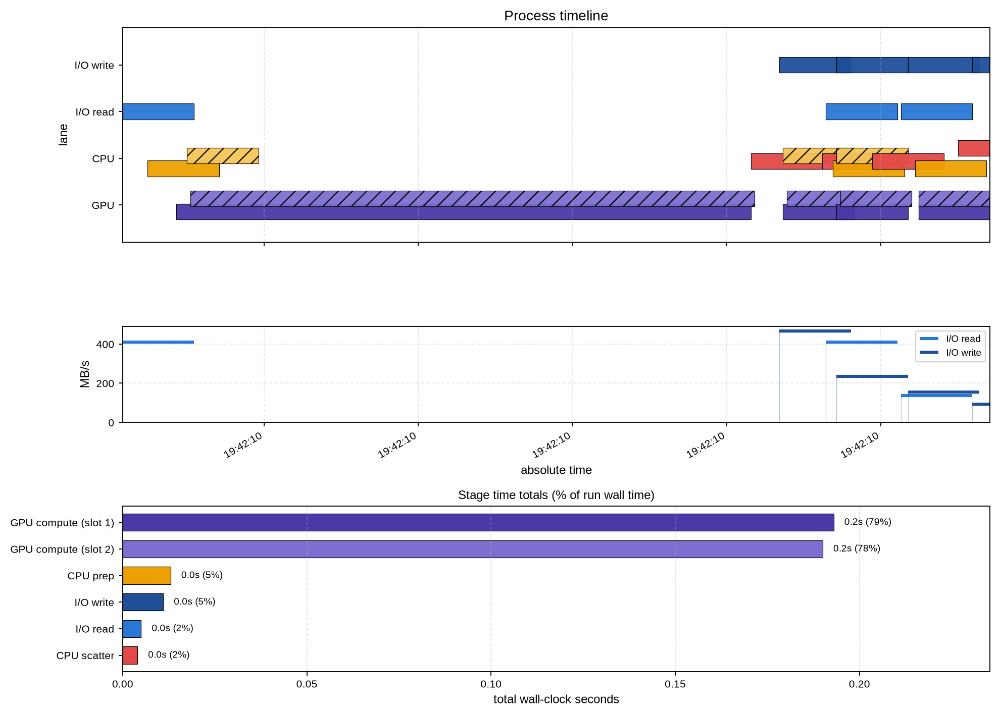
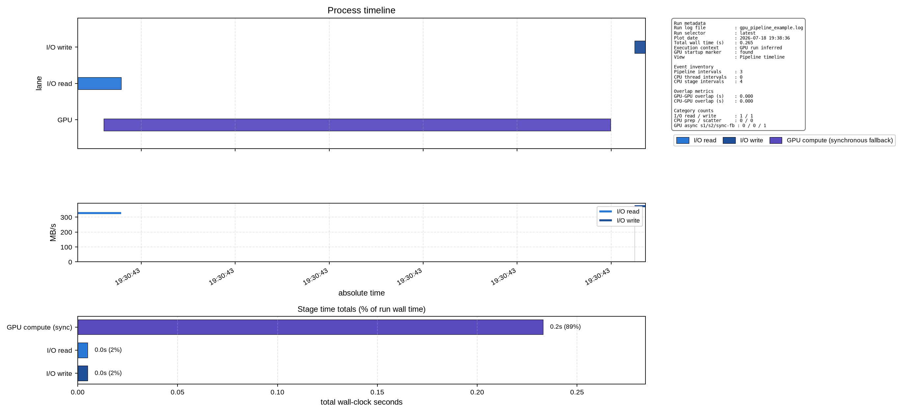
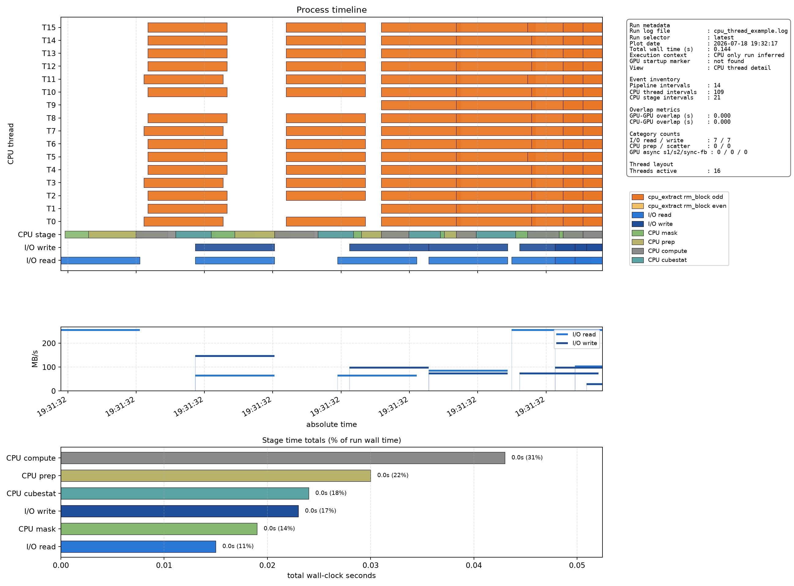

# rmtool

An HPC package for Faraday rotation-measure (RM) tomography on radio
spectro-polarimetric data: RM synthesis, the multi-band preprocessing
that gets mismatched bands ready to combine (matching sky grid,
matching angular resolution, or both), and RM-CLEAN deconvolution —
three things, usable independently or as one pipeline. Built for all
machines, scaling from low-RAM desktop PCs to HPC clusters. Optional
GPU offload for the core RM synthesis transform is also available,
though still early-stage (see [GPU Support](#gpu-support-work-in-progress)).

## Motivation

Modern spectro-polarimetric surveys routinely produce data cubes bigger
than the memory available on any one computer — a laptop, a workstation,
or a single machine in a larger computing cluster. That is simply the
normal size of the data now, and rmtool was designed with this in mind
from the outset.

Many existing tools force a choice that made sense when datasets were
smaller: try to load the whole cube into memory and hope it fits, or
process it one piece at a time on a single processor while the rest of
the computer's capacity goes unused. rmtool does neither. It adapts to
whatever computer it is given — using many processors and plenty of
memory when they are available, and working just as reliably on a
single processor with limited memory when they are not:

- **Processes the cube in memory-sized tiles, shaped to match how the
  data actually sits on disk — and never chops it up more than it has
  to.** rmtool is never *forced* to hold the full cube in RAM, but it
  isn't forced to fragment it either: if the cube is small enough, or the
  machine has enough memory, to fit the whole thing within budget, rmtool
  processes it as a single tile and only subdivides further when the
  image genuinely doesn't fit. That budget is a user-set fraction of the
  machine's *total* memory — deliberately not whatever happens to be
  free at that moment — so the tile size for a given cube and config is
  reproducible on the same machine regardless of what else is running on
  it at the time. (On a busy shared node, that also means the budget
  isn't automatically reduced for other jobs' usage, so a large fraction
  is worth setting conservatively there.) The same configuration scales
  from a modest workstation to a large HPC node unchanged. The tile
  shape itself is chosen for read speed too, when tiling is needed: a FITS
  cube stores each frequency channel as one contiguous RA/Dec plane, with
  RA varying fastest, so rmtool tiles as full-width, multi-row strips.
  Every tile read is then one contiguous block on disk, not a scatter of
  small fragments.
- **Reorganizes each tile once in memory for CPU compute, not on disk —
  and skips that step entirely on the GPU path.** The channel-by-channel
  layout that makes reads fast is not the layout the CPU's per-pixel RM
  synthesis wants, which needs each pixel's full frequency spectrum
  contiguous for an efficient inner loop. rmtool performs that
  reorganization — sometimes called a "corner turn" — once per tile, in
  memory, in parallel, rather than paying for it as slow, scattered disk
  access. The GPU path doesn't pay this cost at all: its preferred
  layout already matches the order data is read in, so tile preparation
  there is a masked copy, not a transpose. If an input cube instead
  arrived already stored spectrum-first per pixel, the CPU path's
  in-memory step could be skipped too; that is not how imaging pipelines
  produce FITS cubes today, but it is a concrete, known place with
  further speed to gain if that convention changes.
- **Overlaps a tile's write with the next tile's read and compute,
  instead of running every stage in strict sequence.** While one tile's
  results are being written to disk, the next tile is already being read
  and processed — concurrently, on a background thread, rather than
  waiting for the write to finish first. A tile's write and the next
  tile's read/compute have nothing to do with each other, so there's no
  reason to make one wait on the other — keeping storage and compute
  both busy at once instead of idling in turn.
- **Reads and writes over multiple parallel channels.** A single I/O
  stream rarely saturates the bandwidth available on shared HPC storage
  (Lustre and similar filesystems); rmtool can open several read and
  write channels concurrently to make fuller use of it.
- **Optional GPU offload, work in progress.** `rm_synthesis` can move
  its core computation onto a graphics card. The same config file works
  unmodified on the CPU-only build too — leave `use_gpu=n`, or leave it
  `y` anyway and the CPU-only build prints a warning and proceeds on CPU
  rather than failing. This path has only been validated on one GPU
  model to date, and isn't yet the recommended default — see
  [GPU Support](#gpu-support-work-in-progress) for the current scope.
- **Most of the above is configuration, not code.** Parallel I/O and
  I/O/compute overlap are opt-in settings in a plain-text config file,
  no recompilation either way. GPU offload is also a config toggle — but
  which of the four build variants to run is still a one-time, per-machine
  build choice; the config format itself doesn't change between them.

The result is one configuration format that scales itself to whatever
machine it's run on, from a single workstation to an HPC
facility, without requiring the user to reason about memory budgets,
concurrency, or hardware-specific tuning.

## Features

**Three tool families, usable independently or as one pipeline:**

- **RM synthesis** (`rm_synthesis`) — the core Fourier-domain transform
  from frequency/λ² space to Faraday depth space. Config-driven
  (KEY=VALUE files), multi-band (merges frequency channels from
  several input files — different pointings, epochs, or telescope
  bands — into one run), subimage extraction for fast iteration,
  native FITS I/O via CFITSIO. Optional GPU offload also exists,
  early-stage — see [GPU Support](#gpu-support-work-in-progress).
- **Multi-band preprocessing** (`reproject_cubes`, `convolve_cubes`,
  `match_cubes`) — real bands rarely arrive on the same sky grid or at
  the same angular resolution; these get them there before
  `rm_synthesis` merges their channels. `reproject_cubes` matches sky
  grid, `convolve_cubes` matches angular resolution, `match_cubes`
  chains both through memory (no intermediate FITS file, which matters
  at real multi-hundred-GB cube sizes) — see
  [Multi-Band Preprocessing Toolchain](#multi-band-preprocessing-toolchain)
  below.
- **RM-CLEAN** (`rmclean_cubes`) — Högbom-style deconvolution of the
  RMSF sidelobes out of a dirty RM cube, the standard cleanup step
  before a publication-ready result; see [RM-CLEAN](#rm-clean) below.
- **End-to-end pipeline script** — `scripts/run_pipeline.sh` chains
  match → rm_synthesis → rmclean from one cfg, with full run provenance;
  see [End-to-End Pipeline](#end-to-end-pipeline) below.

All five tools (the three above plus `reproject_cubes`/`convolve_cubes`
individually) share the same memory-budgeting philosophy
(`mem_frac_ram`) — process data in RAM-budgeted chunks rather than
requiring the whole cube to fit in memory, so a run scales down to a
small machine and up to a large one with no code change. Written in
Fortran 77/90.

## Quick Start

### Prerequisites

- **gfortran** (Fortran compiler)
- **CFITSIO** library (`libcfitsio-dev` on Debian/Ubuntu)
- **GNU Make**

### Build

```bash
# Simple Makefile build (recommended)
make

# Run executable
./bin/rm_synthesis cfg/your_config.cfg
```

Common explicit build variants:

| Build command | Binary produced |
|---|---|
| `make OMP=0 GPU=0` | `bin/rm_synthesis_release_cpu_serial` |
| `make OMP=1 GPU=0` | `bin/rm_synthesis_release_cpu_omp` |
| `make OMP=0 GPU=1` | `bin/rm_synthesis_release_gpu_offload` |
| `make OMP=1 GPU=1` | `bin/rm_synthesis_release_gpu_offload_hostomp` |

The build commands are unchanged; only the binary naming is now clearer.

See [QUICKSTART.md](QUICKSTART.md) for detailed build instructions.

## Documentation

### For users

- **[QUICKSTART.md](QUICKSTART.md)** — Quick reference and build overview
- **[BUILD.md](BUILD.md)** — Comprehensive build system documentation, release tagging policy
- **[docs/user/TUTORIAL.md](docs/user/TUTORIAL.md)** — Step-by-step walkthrough: build, generate sample data, run the full pipeline, inspect the output
- **[docs/user/EXAMPLES.md](docs/user/EXAMPLES.md)** — Recipes for real scenarios: single-band vs. multi-band (matched/mismatched grid/resolution), choosing RM-CLEAN stopping criteria, memory/IO tuning, GPU vs. CPU, subimage extraction
- **[docs/user/APP_REFERENCE.md](docs/user/APP_REFERENCE.md)** — Complete parameter reference for all 5 tools (what each does, every key, every default, output files)
- **[cfg/CONFIG_README.md](cfg/CONFIG_README.md)** — Configuration file reference (`rm_synthesis` cfg parser specifically)
- **[docs/user/ARCHITECTURE.md](docs/user/ARCHITECTURE.md)** — Master architecture document for implemented codebase design
- **[docs/user/PARALLELISM.md](docs/user/PARALLELISM.md)** — Parallelism and memory decomposition deep-dive
- **[docs/user/DESIGN_CPU_GPU_TIMELINE_AND_RM_BLOCKING.md](docs/user/DESIGN_CPU_GPU_TIMELINE_AND_RM_BLOCKING.md)** — Architecture rationale: tiling, RM chunking, CPU/GPU parallelization, offload strategy
- **[docs/user/RELEASE_NOTES_1.0.md](docs/user/RELEASE_NOTES_1.0.md)** — R1.0 "Confluent Brahmaputra": what this release is and what's validated

## Configuration

Every tool is controlled via plain-text `KEY=VALUE` configuration
files, one key per line, `#` for comments. The parser is strict —
unknown keys, duplicate keys, and unparsable values are all rejected
outright, so a config that loads at all is already validated in that
sense. For `rm_synthesis`'s own full key-by-key reference, see
[cfg/CONFIG_README.md](cfg/CONFIG_README.md); for every tool's complete
parameter list (every key, every default, output files), see
[docs/user/APP_REFERENCE.md](docs/user/APP_REFERENCE.md).

## Swim-Lane Plot Generation

Use the swim-lane script to visualize overlap between I/O, CPU staging, and GPU
compute from a consolidated run log.

Generate a plot from a run log:

```bash
python scripts/plot_tile_async_swimlane.py \
	--log scratch/RMSYNTH_OUTPUT.run.log \
	--out scratch/tile_async_swimlane.png \
	--run latest \
	--time-axis absolute
```

Key options:

- `--run latest|first|N` selects which detected run block from the log to plot.
- `--time-axis absolute|relative` chooses wall-clock vs seconds-from-run-start.
- `--out` controls output PNG path.

The script also prints summary metrics (interval count, window seconds,
GPU-GPU overlap, CPU-GPU overlap) to stdout.

Every plot now includes a **stage time totals** bar panel underneath the
timeline: total wall-clock seconds per stage, sorted largest-first, with
seconds and % of total run wall time labelled on each bar. A bar chart
rather than a pie, since real runs are often extremely skewed (one stage
at >90% of wall time) -- a pie would render that as one slice and an
unreadable sliver soup. Percentages can add up to more than 100%; that's
expected when stages overlap in wall time (e.g. `io_overlap=y`), not a
bug. The side panel's `Thread IDs` line (CPU thread detail view) was
dropped in favour of just `Threads active` (a count) -- the full ID list
stopped being useful information once thread counts got into the teens.

Design rationale and diagnostic interpretation notes are documented in
[docs/user/DESIGN_CPU_GPU_TIMELINE_AND_RM_BLOCKING.md](docs/user/DESIGN_CPU_GPU_TIMELINE_AND_RM_BLOCKING.md).

Example swim-lane plots, current as of the I/O throughput (MB/s) panel and
the "CPU stage" row's compute segment (both described above):

Pipeline/stage-overlap view (async, double-buffered GPU dispatch --
`gpu_offload_hostomp` binary, staged VRAM sub-blocks):



Pipeline/stage-overlap view (synchronous-fallback GPU dispatch -- a tile
that fits in one VRAM sub-block, so there's no double-buffering to overlap):



CPU thread-detail view (`io_read_threads`/`io_write_threads`/`io_overlap`
all active):



## GPU Support (Work in Progress)

`rm_synthesis` can optionally offload its core computation to a GPU via
OpenMP target offload. This is real and working, but still early-stage
— not yet the recommended default, and not something the other four
tools (`reproject_cubes`/`convolve_cubes`/`match_cubes`/`rmclean_cubes`)
support at all.

- `use_gpu=n` (default) runs host (CPU) execution; `use_gpu=y` requests
  GPU execution on a GPU-capable binary (`make GPU=1`). The same config
  file works on either build — `use_gpu=y` on a CPU-only binary prints
  a warning and falls back to CPU rather than failing.
- **Validation scope is narrow so far**: tested on one GPU model,
  `NVIDIA GeForce RTX 3050 (6 GiB VRAM)`, with GNU OpenMP offload
  (`nvptx`). AMD ROCm and Intel GPU offload targets are not yet
  validated at all. Treat GPU runs on any other hardware as
  experimental, and confirm with a short controlled run first.
- On the hardware validated to date, throughput is bounded by
  host-device transfer bandwidth (PCIe) more than by the GPU's own
  compute capacity — there's real headroom left to tune, not a finished
  ceiling.

```bash
# Build GPU/offload-capable binary
make GPU=1
bin/rm_synthesis_release_gpu_offload_hostomp cfg/rmsynth.cfg

# Useful runtime environment variables
OMP_TARGET_OFFLOAD=MANDATORY   # fail if offload cannot run
OMP_DEFAULT_DEVICE=0           # choose target device index
```

## Multi-Band Preprocessing Toolchain

Real bands rarely arrive on the same sky grid or at the same angular
resolution. Three standalone tools (own binaries, own build targets,
independent of the main `rm_synthesis` build graph) close that gap before
a multi-band run:

1. **`reproject_cubes`** — reprojects two or more FITS cubes onto one
   common sky grid, using Starlink AST for WCS handling and `astResampleR`
   for resampling. Three footprint modes:

   ```bash
   make reproject_cubes
   bin/reproject_cubes mode=intersection reffile=ref.fits infiles=a.fits,b.fits
   # mode=union | reference also available; --help for the full option list
   ```

2. **`convolve_cubes`** — convolves all channels, across all input files,
   to one common angular resolution (or an explicit target). Reads
   per-channel beams from a CASA-style `BEAMS` binary table (auto-detected)
   or a portable ASCII/CSV beam log (see `cfg/example_beamLog.txt` and
   `cfg/example_beamLog.csv` for the format — nobody should have to
   reinvent it from scratch). A channel is treated as bad — its output
   plane written as all-NaN, not convolved, and automatically excluded by
   `rm_synthesis`'s own NaN detection later, no extra config needed — if
   it's missing from the beam log entirely, or present with `BMAJ` or
   `BMIN` equal to 0:

   ```bash
   make convolve_cubes
   bin/convolve_cubes infiles=bandA.fits,bandB.fits mem_frac_ram=0.25
   # target beam is auto-derived (smallest beam every good channel of
   # every input can be deconvolved from) unless target_bmaj/target_bmin/
   # target_bpa are given explicitly; --help for the full option list
   ```

3. **`match_cubes`** — consolidates the two tools above into one: run
   reproject alone, convolve alone, or both CHAINED THROUGH MEMORY with no
   intermediate FITS file written at all. For real 200GB+ cubes, chaining
   avoids writing (and re-reading) a full extra copy of the data to disk.
   `order` controls which stage runs first when both are requested
   (default `convolve_reproject` — convolving before resampling low-pass-
   filters the image ahead of interpolation, avoiding aliasing error, and
   is usually cheaper too):

   ```bash
   make match_cubes
   bin/match_cubes stages=both order=convolve_reproject \
     footprint_mode=intersection reffile=ref.fits infiles=bandA.fits,bandB.fits \
     mem_frac_ram=0.25
   # stages=reproject | convolve | both; --help for the full option list
   ```

   `reproject_cubes` and `convolve_cubes` are unaffected and remain fully
   independent for anyone who only needs one stage.

**Skip-if-already-matched:** all three tools check each input file
individually against the already-computed target grid/beam before
processing it, and skip (no output written, original file used as-is)
any input that's already effectively identical to what its own output
would have been — tight tolerances (~1e-9 for CRVAL/CDELT/rotation,
~1e-6 for BMAJ/BMIN/BPA), never a "close enough" fuzzy match, so a
false skip can't silently misalign downstream RM synthesis. Every
output path is checked for pre-existence *before* any processing
starts — a stray file left over from an earlier run always aborts the
run rather than being silently reused or overwritten. `match_cubes`
additionally accepts `manifest=<path>`, writing one tab-separated
`<infile> SKIPPED|PROCESSED <effective_path>` line per input once all
processing completes — the machine-readable record `scripts/
run_pipeline.sh` reads to chain match's own output into `rm_synthesis`
without ever having to guess an outcome from filesystem state.

Typical order for a genuinely mismatched multi-band dataset: convolve
(match resolution, across all bands together in one call) → reproject
(align grids) → `rm_synthesis` (multi-band RM synthesis on the now
resolution- and grid-matched inputs) — either as two standalone-tool
calls, or as one `match_cubes stages=both` call with no intermediate file.

**Beam metadata:** all three tools propagate `CASAMBM`/`BEAMS` the same
way `rm_synthesis` does for its own outputs (see
[docs/user/APP_REFERENCE.md](docs/user/APP_REFERENCE.md) for the full
rm_synthesis beam-metadata behavior). `reproject_cubes`
(and `match_cubes` with `stages=reproject`) never touch the beam itself —
a genuine per-channel `BEAMS` table on the input is copied through to the
output unchanged. `convolve_cubes` (and `match_cubes` whenever `convolve`
is active) always attach `CASAMBM=T` plus a freshly synthesized `BEAMS`
table — one row per channel, the common target beam for every channel
actually convolved, and the same degenerate sentinel CASA itself uses for
a bad/skipped channel — so a downstream reader can tell exactly which
channels reached the common resolution, rather than a single scalar
`BMAJ`/`BMIN`/`BPA` that would misrepresent a bad/NaN channel as sharing
it.

Full design detail, verification evidence, and the underlying computation
modules (`src/gaussft.f90`, `src/commonbeam.f90`) are documented in
[docs/dev/MULTI_BAND_TOMOGRAPHY_PLAN.md](docs/dev/MULTI_BAND_TOMOGRAPHY_PLAN.md)
(tickets T10-T14) and in each source file's own header comment.

## RM-CLEAN

`rmclean_cubes` — standalone RM-CLEAN (Högbom-style deconvolution),
driving `rmclean_mod` (`src/rmclean.f90`, pure computation, no FITS I/O
of its own) against a real dirty AMP/PHA cube pair `rm_synthesis` itself
wrote, plus its `.MASK.CUBE.FITS`/`CHANFREQ` table:

```bash
make rmclean_cubes
bin/rmclean_cubes ampfile=out.AMP.RMCUBE.FITS phafile=out.PHA.RMCUBE.FITS \
  maskfile=out.MASK.CUBE.FITS outfile=out_cleaned \
  abs_flux_floor=20uJy auto_nsigma=1.0 niter=500 gain=0.1
# writes out_cleaned.CLEAN/.RESID/.RESTORED.AMP/PHA.RMCUBE.FITS;
# full parameter reference (every key, default, and meaning) in
# docs/user/APP_REFERENCE.md -- --help on the binary prints the same list
```

CLEAN stops on any of three independent, freely-combinable criteria,
checked every iteration: `niter` (a hard iteration cap, always active),
`abs_flux_floor=<v>` (stop the instant a pixel's own peak amplitude
drops to/below a literal fixed flux value — a bare number in native
AMP-cube units, or with a `Jy`/`mJy`/`uJy` suffix, no space, e.g.
`abs_flux_floor=10mJy`), and `auto_nsigma=<n>` (stop at `n`× that same
pixel's own noise sigma, estimated once per pixel from its own full
dirty amplitude spectrum's interquartile range via the analytic
Rayleigh-distribution relation — dirty amplitude is Rayleigh-, not
Gaussian-, distributed). `abs_flux_floor` and `auto_nsigma` are each
independently opt-in; give either, both, or neither (in which case
CLEAN runs every pixel for the full `niter` iterations, with a printed
NOTE saying so). **If you have an older cfg**: the earlier
`threshold=`/`threshold_snr=`/`noise_percentile=`/`noise_nlos=`/
`noise_seed=` keys have been removed entirely (not aliased) — replace
with `abs_flux_floor=`/`auto_nsigma=` above.

This tool cannot resample the RM axis — it's fixed by whatever `CDELT3`
`rm_synthesis` already wrote — so it validates the existing grid instead
(Gate 0: refuses to proceed if the grid doesn't resolve the RMSF fwhm at
`min_samples_per_fwhm`, default 2) rather than silently producing a
wrong answer. Notably, the dirty cube only needs ordinary
resolution-level sampling — CLEAN's own sub-pixel peak refinement fits
against the analytically-known RMSF model rather than interpolating the
stored samples, so no finer (`lsq_ref`-dependent) sampling of the RM
axis is required, and a cheap model-consistency fast path handles the
common case with a full local search reserved for iterations whose
misfit exceeds `refine_nsigma` × the data-driven noise estimate.
Per-pixel work is parallelized over OpenMP (one thread per pixel,
embarrassingly parallel along the RM axis), with a mask-pattern cache
sharing one RMSF table across every pixel with the same valid-channel
set, rather than rebuilding it per pixel. GPU support is explicitly
deferred to a later, separate effort.

Memory-budgeted, threaded, tiled I/O is the same scheme `rm_synthesis`
already uses: spatial tiles sized by `mem_frac_ram`
(`tile_ra`/`tile_dec`/`tile_auto`), parallel readonly chunked tile
reads (`io_read_threads`), raw-stream-write tile output bypassing
CFITSIO (`io_write_threads`), and pthread-based double-buffered
write-behind (`io_overlap`) — so a cube far larger than available RAM
CLEANs in bounded memory, not just `rm_synthesis`'s own dirty-cube
synthesis step. The mask cube is now read in the same memory-budgeted
tiles as the AMP/PHA float cubes, rather than held whole in memory
regardless of size — `mem_frac_ram` budgets all three together, and the
per-tile mask-pattern cache builds up incrementally as tiles are
processed (no locking needed: the tile loop's own strict sequencing
already guarantees a pattern is never looked up before it's cached). A
big machine still gets the equivalent of one whole-cube-resident mask
read for free, when it fits the budget; a small machine gets smaller
tiles automatically instead of running out of memory.

`rm_synthesis` itself can build its dirty AMP/PHA cube at a
computationally cheaper phase reference than the default (`lsq_ref_mode=
mid|centroid|min|max|fixed`, default `zero` — this project's own
historical thesis-matching convention, unaffected unless set
explicitly); whichever reference is actually used is recorded in a new
`LSQREF` header keyword so `rmclean_cubes` never has to assume one.

Full parameter reference: [docs/user/APP_REFERENCE.md](docs/user/APP_REFERENCE.md).
Full design detail and verification evidence are documented in
[docs/dev/RMCLEAN_INTEGRATION_PLAN.md](docs/dev/RMCLEAN_INTEGRATION_PLAN.md)
(tickets T0-T11) and in `src/rmclean.f90`/`src/rmclean_cubes.f90`'s own
header comments.

## End-to-End Pipeline

`scripts/run_pipeline.sh` chains `match_cubes` → `rm_synthesis` →
`rmclean_cubes` (any leading/trailing subset via `stages=`) from one small
orchestration cfg, driven by `cfg/pipeline-example.cfg` (fully annotated
template):

```bash
scripts/run_pipeline.sh --help          # full option list, read this first
scripts/run_pipeline.sh cfg/pipeline-example.cfg
```

It invents no new algorithmic options — every stage tool keeps its own
complete, independently-tested cfg/CLI interface (`rmsynth_cfg_template`/
`rmclean_cfg_template` point at a real, hand-written cfg for that tool;
every key in it except the path-shaped ones the pipeline itself must
chain — `path`/`infileQ`/`infileU`/`outfile` for `rm_synthesis`,
`ampfile`/`phafile`/`maskfile`/`outfile` for `rmclean_cubes` — is used
exactly as written). The orchestrator's only job is chaining those
path-shaped values between stages and driving execution in the right
order with the right CPU thread pinning (reusing `scratch/
run_rmsynthesis_test.sh`'s own `OMP_PROC_BIND=close`/`OMP_PLACES=cores`
convention for the `rmsynth` stage).

**Stage chaining**: when `match` runs, its own manifest (`manifest=`,
see above) — never filesystem state — determines which file
(`match_cubes`' own output, or the original input if it was skipped)
feeds `rm_synthesis`'s `infileQ`/`infileU`. Q and U bands are always
combined into one `match_cubes` call (not run per-polarization), since
that's the only way to guarantee both land on the identical output
grid/beam by construction — see the script's own header comment for
why running them separately risks a mismatch.

**Provenance**: every run leaves records in `<outdir>/<run_name>.
provenance/` — a copy of the pipeline cfg used, the fully-substituted
per-stage cfgs actually fed to each tool, the match manifest, every
external command actually invoked, each stage's own full stdout+stderr,
and a `run_summary.txt` with per-stage timing and final output paths.
This directory is shared across repeated runs of the same
`outdir`/`run_name` (each run's own files are timestamp-tagged, so
they simply accumulate rather than collide) — it's metadata
scaffolding, not a data output, so its own pre-existence never blocks a
run. The actual DATA outputs (every cube each stage tool writes) are
what's protected: each is checked for pre-existence before that stage
runs, and the whole pipeline aborts rather than silently deleting or
overwriting a prior run's real result.

## Project Structure

```
rmtool/
├── src/                       Source code (Fortran 77/90)
│   ├── rm_synthesis.f90       Main program (free-form F90); `include`s
│   │                          myfits_info.f90/printerror.f90 below at compile time
│   ├── rm_synthesis_mod.f90   Shared module: config parser, timers/logging, helpers
│   ├── myfits_info.f90, printerror.f90   Free-form F90 helpers, pulled into
│   │                                      rm_synthesis.f90 via `include`
│   ├── reproject_cubes.f90    Standalone: cross-band sky-grid alignment (own binary)
│   ├── gaussft.f90            gaussft_mod: pure elliptical-Gaussian FFT-domain
│   │                          deconvolve/reconvolve computation, no I/O
│   ├── commonbeam.f90         commonbeam_mod: smallest common beam across N PSFs
│   ├── convolve_cubes.f90     Standalone: cross-band resolution matching (own binary),
│   │                          drives gaussft_mod + commonbeam_mod
│   ├── match_cubes.f90        Standalone: reproject_cubes + convolve_cubes consolidated,
│   │                          chained through memory (own binary; neither of the above
│   │                          two is modified/shared -- adapts their logic instead)
│   ├── rmclean.f90            rmclean_mod: RM-CLEAN core (Högbom deconvolution), pure
│   │                          computation, no FITS I/O of its own
│   ├── rmclean_cubes.f90      Standalone: RM-CLEAN driven against real dirty AMP/PHA
│   │                          cubes rm_synthesis wrote (own binary)
│   └── legacy/                Older standalone FITS utilities, not part of the build
├── cfg/                        Configuration files, examples, and ARCHIVED/ (63 historical configs);
│                                example_beamLog.txt/.csv for convolve_cubes' ASCII beam format
├── docs/
│   ├── user/                   User-facing docs: tutorial, examples, app reference,
│   │                            architecture/parallelism deep-dives, release notes
│   └── dev/                    Internal ticket-by-ticket planning history, and
│       └── ARCHIVED/            superseded pre-R1.0 release notes/changelog
├── scripts/                    Swim-lane plotting and benchmark tooling
├── tests/                      Regression suite (tests/run_tests.sh)
├── TODO/                       Historical development logs and assessments
├── docker/                     Container build/release helpers
├── scratch/                    Ad-hoc run outputs, example logs/plots (gitignored)
├── bin/                        Compiled executables
├── build/                      Build artifacts (Makefile)
├── Makefile                    Primary development build (OMP/GPU variants)
├── build.sh                    Quick build wrapper script
└── BUILD.md, QUICKSTART.md     Build and quick-start documentation
```

## Development

### Branch Structure

- **main** — Stable, production-ready releases
- **develop** — Active development branch

### Release Tags

- Public release tags use an `R`-prefixed `MAJOR.MINOR` format (for
  example: `R1.0`, `R1.1`, `R2.0`) on `main`, each with a codename
  alias tag pointing at the same commit (e.g. `R1.0` /
  `confluent-brahmaputra`). The `R` prefix is deliberate: this
  package's internal pre-public development already used plain
  `1.0`-`6.0` as milestone tags (see `docs/dev/ARCHIVED/`), so an
  unprefixed `1.0` would collide with one of those.
- The first public release tag is `R1.0`.
- Milestone-style tags can still exist for internal checkpoints, but
  official public releases use the `R`-prefixed format above.

### Building

```bash
make              # Build release
make MODE=debug   # Build with symbols
make clean        # Clean artifacts
```

## License

See [LICENSE](LICENSE) file for details.

## Contact

For questions or contributions, please open an issue or contact the maintainers.
