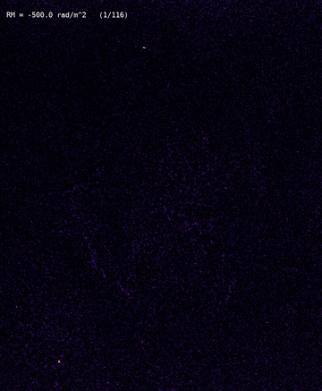

# rmtool

The rmtool package is intended for performing Faraday tomography (or
rotation-measure (RM) synthesis) on radio spectro-polarimetric data.
In addition to processing data from a single contiguous band, rmtool
provides the necessary applications to appropriately combine
heterogeneous multi-band data from different telescopes/bands with
different native projections and angular resolutions. Deconvolution
becomes critical for data sparsely sampled in the spectral domain; the
RM-CLEAN algorithm provided handles this appropriately.

One key motivation for this package is to address Faraday tomography
of the big data cubes that modern observatories are generating at
present. Current packages are unable to handle this data, either
because of the narrow scope they were designed for (i.e. aimed at
small-to-moderate sized data cubes), or because of limited HPC
strategies built into these algorithms. This package addresses both —
every application in it can process large data cubes optimally on
both PCs with small core counts and RAM, as well as HPC-grade nodes
with hundreds of cores and TBs worth of shared memory.

## Demo

RM-CLEAN's restored output from a real WALLABY/EMU multi-band cube reveals line of sight components of the magnetic fields that are in opposite direction at the two edges of this supernova remnant PKS1209-52.



**Highlights**

- **Handles cubes larger than RAM.** Data is processed in tiles sized
  to a user-set fraction of system memory (`mem_frac_ram`) — the same
  config runs on a laptop or an HPC node without need for changes.
- **Multi-band pre-processing built in.** Provides tools for matching
  sky-grid projections between multi-band data, and angular resolution
  across multiple bands as well as across the spectral axis of a
  single band. These two stages can be chained together to avoid
  writing intermediate files, saving huge amounts of disk space for
  large cubes.
- **RM-CLEAN included**, sharing the same tiled, memory-budgeted I/O
  engine as RM synthesis. Correctly handles "gaps" in data due to RFI,
  and from multiple widely separated bands.
- **Parallel, overlapped I/O** for HPC filesystems: multiple concurrent
  read/write channels, with a tile's write overlapped against the next
  tile's read and compute.
- **Optional GPU offload** for the core RM synthesis transform
  (work in progress — see [GPU Support](#gpu-support-work-in-progress)).
- **Configuration files.** Flexible run configuration using plain-text
  `KEY=VALUE` pair files to control memory budget, threading, I/O
  parallelism, GPU use, etc., in addition to RM-synthesis-specific
  parameters.

## What's Included

| Tool | Binary | Does |
|---|---|---|
| RM synthesis | `rm_synthesis` | The core λ²→Faraday-depth transform |
| Reproject | `reproject_cubes` | Aligns cubes onto one common sky grid (WCS reprojection) |
| Convolve | `convolve_cubes` | Convolves cubes to one common angular resolution |
| Match | `match_cubes` | Reproject + convolve chained through memory, no intermediate file |
| RM-CLEAN | `rmclean_cubes` | Högbom-style CLEAN deconvolution of RMSF sidelobes |
| Pipeline | `scripts/run_pipeline.sh` | Chains match → rm_synthesis → rmclean from one config |

## Choosing the Right Tool for Your Data

| Your situation | Run this | Example |
|---|---|---|
| Single band, channels already at consistent resolution, and (if multiple bands) same sky grid | `rm_synthesis` | [EXAMPLES.md §1](docs/user/EXAMPLES.md#1-single-band-quickstart) |
| Different sky grid — one band's pointing vs. another's | `reproject_cubes`, then `rm_synthesis` | [EXAMPLES.md §2b](docs/user/EXAMPLES.md#2b-sky-grid-mismatched-resolution-already-matched--reproject_cubes-only) |
| Different angular resolution — across bands, or across channels of a single band (native beam varies with frequency) | `convolve_cubes`, then `rm_synthesis` | [EXAMPLES.md §2c](docs/user/EXAMPLES.md#2c-resolution-mismatched-sky-grid-already-matched--convolve_cubes-only) |
| Multiple bands, both grid and resolution differ | `match_cubes`, then `rm_synthesis` | [EXAMPLES.md §2d](docs/user/EXAMPLES.md#2d-both-mismatched--match_cubes-chained-through-memory) |
| Need CLEAN deconvolution of a dirty RM cube | `rmclean_cubes` | [EXAMPLES.md §3](docs/user/EXAMPLES.md#3-choosing-rm-clean-stopping-criteria) |
| Want one command for match → rmsynth → rmclean | `scripts/run_pipeline.sh` | [TUTORIAL.md §6](docs/user/TUTORIAL.md#6-running-the-full-pipeline-in-one-command) |

Not sure which case applies? [docs/user/EXAMPLES.md §2](docs/user/EXAMPLES.md#2-multi-band-which-preprocessing-do-i-need) walks through how to tell.

## Quick Start

**Prerequisites:** gfortran, the CFITSIO library (`libcfitsio-dev` on
Debian/Ubuntu), GNU Make. Starlink AST and FFTW3 are additionally
needed for `reproject_cubes`/`convolve_cubes`/`match_cubes`/
`rmclean_cubes` — see [BUILD.md](BUILD.md) for install instructions.

```bash
make                                   # build rm_synthesis (CPU, OpenMP)
./bin/rm_synthesis cfg/rmsynth.cfg     # run it
```

| Build command | Binary produced |
|---|---|
| `make OMP=0 GPU=0` | `bin/rm_synthesis_release_cpu_serial` |
| `make OMP=1 GPU=0` | `bin/rm_synthesis_release_cpu_omp` (recommended for multi-core) |
| `make OMP=0 GPU=1` | `bin/rm_synthesis_release_gpu_offload` |
| `make OMP=1 GPU=1` | `bin/rm_synthesis_release_gpu_offload_hostomp` |

For a full walkthrough — build, generate sample data, run RM synthesis
and RM-CLEAN, inspect the output — see
[docs/user/TUTORIAL.md](docs/user/TUTORIAL.md). For every build variant
and the validation test suite, see [QUICKSTART.md](QUICKSTART.md).

**No Q/U data of your own yet?** `scripts/casda_fetch.py` fetches
calibrated POSSUM Stokes Q/U cutouts from the CSIRO ASKAP Science Data
Archive (CASDA) around a sky position, and curates the per-channel beam
info `convolve_cubes` needs whenever a cube doesn't already carry its
own (no manual archive digging required):

```bash
python3 scripts/casda_fetch.py --target "Centaurus A" --username you@example.org --fetch
```

See [QUICKSTART.md §4a](QUICKSTART.md#4a-getting-a-test-object) for the
free-account setup and full detail.

## Configuration

Every tool reads a plain-text `KEY=VALUE` config file (`cfg/`), one key
per line, `#` for comments. The parser is strict: unknown keys,
duplicate keys, and unparsable values are all rejected outright, so a
config that loads at all is already validated in that sense.
[cfg/rmsynth.cfg](cfg/rmsynth.cfg) is a fully annotated template; the
complete key-by-key reference for every tool is in
[docs/user/APP_REFERENCE.md](docs/user/APP_REFERENCE.md).

## GPU Support (Work in Progress)

`rm_synthesis` can optionally offload its core transform to a GPU via
OpenMP target offload (`make GPU=1`, `use_gpu=y`). This is real and
working, but early-stage: validated on one GPU model so far
(`NVIDIA GeForce RTX 3050`), not yet the recommended default, and not
supported by the other four tools. See
[EXAMPLES.md §6](docs/user/EXAMPLES.md#6-gpu-vs-cpu-which-build-should-i-use)
for guidance on choosing CPU vs. GPU.

## Documentation

| Doc | Covers |
|---|---|
| [QUICKSTART.md](QUICKSTART.md) | Build variants, validation test suite, running on real data |
| [BUILD.md](BUILD.md) | Build system details, requirements, release tagging policy |
| [docs/user/TUTORIAL.md](docs/user/TUTORIAL.md) | Step-by-step: build → synthetic data → rm_synthesis → rmclean → inspect output |
| [docs/user/EXAMPLES.md](docs/user/EXAMPLES.md) | Recipes by scenario: single/multi-band, CLEAN stopping criteria, memory/IO tuning, GPU vs. CPU, subimage extraction |
| [docs/user/APP_REFERENCE.md](docs/user/APP_REFERENCE.md) | Full parameter reference for every tool: every key, every default, output files |
| [cfg/CONFIG_README.md](cfg/CONFIG_README.md) | `rm_synthesis` config parser rules |
| [docs/user/RELEASE_NOTES_1.0.md](docs/user/RELEASE_NOTES_1.0.md) | What's in R1.0 "Confluent Brahmaputra" and what's been validated |

Internal architecture/engineering documentation lives under `docs/dev/`.

## Development

- **Branches:** `main` (stable releases), `develop` (active development).
- **Release tags:** `R`-prefixed `MAJOR.MINOR` on `main` (e.g. `R1.0`),
  each with a codename alias tag pointing at the same commit (`R1.0` /
  `confluent-brahmaputra`). See [BUILD.md](BUILD.md#release-tagging-policy)
  for why the `R` prefix.

## License

See [LICENSE](LICENSE). For questions or contributions, please open an issue.
