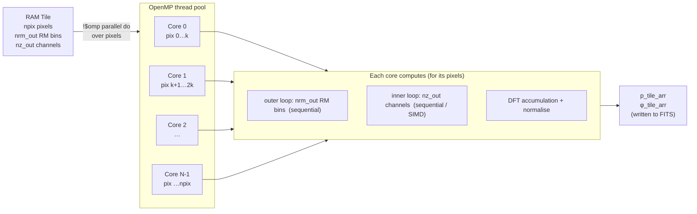
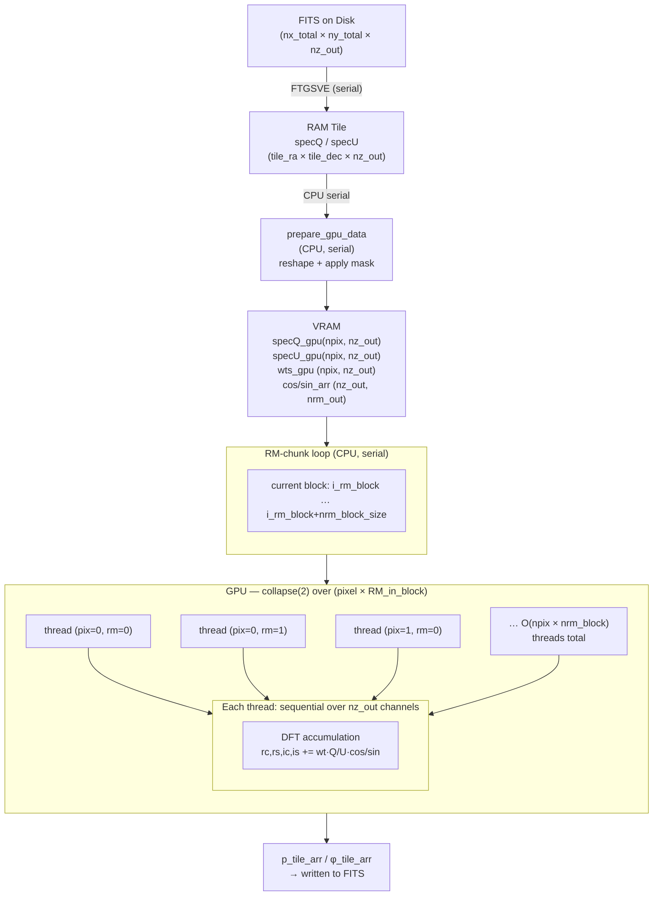
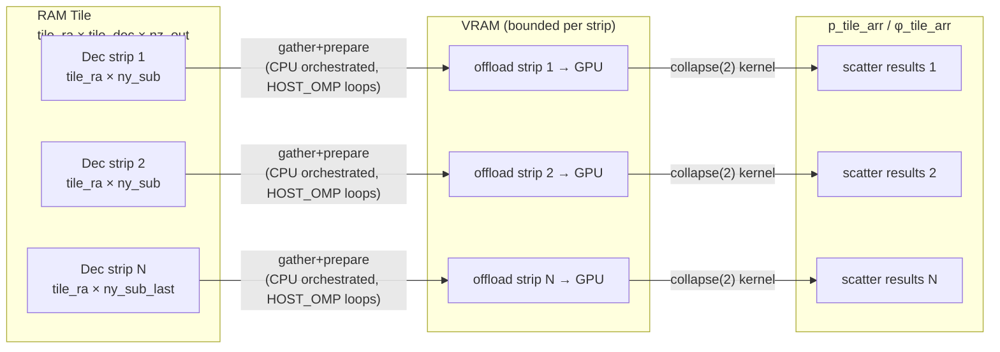

# RM-Synthesis Parallelism and Memory Architecture

This document describes how `rm_synthesis` tiles the sky image, loads it into
RAM/VRAM, and distributes work across CPU cores or GPU threads.

---

## 1 — Tiled FITS I/O: read, write, and cross-tile overlap

The full sky image is too large to hold in RAM at once (e.g. 25k×25k×236
channels). The code reads it in **spatial tiles** chosen to fit within a
user-controlled fraction of available RAM (`mem_frac_ram`). The *tile
loop itself* is always serial (tile N+1 is never computed before tile N
is), but each tile's read, write, and the boundary between consecutive
tiles can each independently be made concurrent via three orthogonal cfg
keys — `io_read_threads`, `io_write_threads`, and `io_overlap`. All three
default to the fully serial behaviour below; see
`docs/ARCHITECTURE.md` ("Parallel read/write" and "Async read/write
overlap") and `planning/IO_PARALLEL_OPTIMISATION_PLAN.md` for the full
design, safety history, and postmortems.

```
DISK  ─────────────────────────────────────────────────────────────────────────
  Q.FITS  [nx_total × ny_total × nz_out]   (e.g. 25600 × 25600 × 236 ch)
  U.FITS  [nx_total × ny_total × nz_out]
            │
            │  FTGSVE  (CFITSIO strided sub-image read)
            │    io_read_threads=1 (default): one serial call
            │    io_read_threads=N: N read-only CFITSIO handles, each
            │    reading a disjoint channel range concurrently
            ▼
RAM  ──────────────────────────────────────────────────────────────────────────
  specQ  [tile_ra × tile_dec × nz_out]     flat float32 array
  specU  [tile_ra × tile_dec × nz_out]     flat float32 array
  mask_tile_arr [tile_ra × tile_dec × nz_out]  int8, built in single pass:
        ├─ global bad channels  (flag_arr_out)
        ├─ NaN/Inf in Q or U
        └─ input mask FITS       (if provided)
```

The outer loop over tiles is always serial — tile N+1's read never starts
before tile N's compute has produced the data its own write depends on —
but write(N) and read/compute(N+1) touch entirely different files (output
AMP/PHA vs. input Q/U) with no data dependency between them, so they can
run concurrently instead of one waiting on the other:

```
Fully serial (io_overlap=n, default):
for ix_tile, iy_tile  (serial)
    FTGSVE → specQ, specU                     ← read (parallel if io_read_threads>1)
    build mask_tile_arr                        ← serial single pass
    extract P(RM, pixel)                       ← CPU or GPU, see §2/§3
    write AMP/PHA/… → output FITS               ← write (parallel if io_write_threads>1)
                                                   ^ next tile's read waits for this

Overlapping (io_overlap=y):
  tile N:   read → mask → prep → compute → write(N) ──────────────┐
  tile N+1:                                   read → mask → prep → compute → write(N+1)
                                                    ^ write(N) now runs on a background
                                                      pthread, hidden behind tile N+1's
                                                      own read/mask/prep/compute
```

**Write parallelism (`io_write_threads`)**, independent of the above:
each tile's AMP/PHA write splits its RM bins into N disjoint chunks, each
written by its own Fortran STREAM I/O unit directly to its byte offset —
bypassing CFITSIO's write path for pixel data entirely, so N independent
writes to disjoint byte ranges of the same file are POSIX-safe. 2D map
outputs (MASK, NVALID, cubestat) always write via a single serial CFITSIO
call regardless of `io_write_threads` — their cost is negligible next to
the RM cube writes.

`io_overlap`'s background write and `io_write_threads`'s RM-chunk split
compose: the write pthread dispatched for tile N can itself fan out into
N raw-write threads, all while tile N+1's read/compute proceeds on the
main thread. Both are validated bit-identical to the fully serial path,
together and separately. **The two keys are fully independent** — either
can be set without the other:

| `io_write_threads` | `io_overlap` | Behaviour |
|---|---|---|
| 1 | n | Fully serial — pre-T5/T6 behaviour |
| N>1 | n | Each tile's write is N-way parallel, but the main thread waits for it to finish before starting the next tile's read |
| 1 | y | Write(N) hidden behind tile N+1's read/compute, but the write itself is a single serial writer |
| N>1 | y | Both: write(N) is N-way parallel *and* hidden behind tile N+1 |

If RAM is tight (so `io_overlap`'s doubled buffers are a problem) but the
output storage is parallel (Lustre/NFS/cloud), `io_write_threads=N>1`
alone with `io_overlap=n` is a lower-memory way to still get a real write
speedup — you just don't get the "hide it behind the next tile" benefit
on top.

### Thread-pool interplay: how `OMP_NUM_THREADS`, `io_read_threads`, `io_write_threads`, and `io_overlap` actually share cores

Every `!$omp parallel do` region draws its worker OS threads from
libgomp's thread pool — but that pool is **owned by whichever host
thread encounters the region**, not shared globally across threads.
Verified empirically: a background pthread and the main thread each
entering their own 4-thread `omp parallel` region at the same instant
produced **8 distinct OS threads running fully concurrently** — not 4
threads shared between the two regions, serializing them. Practically:

| Mechanism | Which thread runs it | Threads it uses | Concurrent with |
|---|---|---|---|
| `io_read_threads=N` | Main thread | Up to N, from the main thread's own pool — reused for every `!$omp parallel do` the main thread issues | Nothing else: read finishes before mask/prep/compute starts, same tile, same thread |
| Mask/prep/compute (`OMP_NUM_THREADS`) | Main thread | Up to `OMP_NUM_THREADS`, same pool as read | The **write pthread**, if `io_overlap=y` and a previous tile's write is still running |
| `io_overlap=y` write dispatch | A fresh pthread, spawned per tile (`tile_write_dispatch_async`) | Just the pthread itself (1 extra OS thread) if `io_write_threads=1` | The main thread's entire next-tile read → mask → prep → compute → cubestat sequence |
| `io_write_threads=N>1` | The write pthread (not the main thread) | A **second, separate** pool of N OS threads — created fresh every tile, since the write pthread itself is fresh every tile | Whatever the main thread is doing at that moment |

So `io_read_threads` never competes with compute for cores — they run
sequentially on the same thread. `io_write_threads` and `io_overlap`,
together, genuinely add OS threads on top of whatever the main thread is
using at that moment — real, additive demand on cores, not shared reuse.
In practice this is usually cheap: read/write threads are I/O-bound
(mostly blocked waiting on the actual disk/network operation) rather
than CPU-bound like compute, so the OS scheduler hands compute the core
time whenever a read/write thread is blocked — but it *is* genuine
oversubscription, not something the runtime silently avoids. Setting
`io_write_threads` to something close to `OMP_NUM_THREADS` (rather than
a modest value like the storage's stripe count) is where this actually
starts to cost real compute throughput, since the byte-swap work across
that many threads is no longer negligible.

#### Rule of thumb for setting thread counts

| Setting | Recommendation | Why |
|---|---|---|
| `OMP_NUM_THREADS` | All available cores | The only thread type here that's genuinely CPU-bound and wants a dedicated core continuously |
| `io_read_threads` | Storage stripe count (e.g. `lfs getstripe`, typically 4–16) | Runs before compute starts, same thread — effectively free to raise |
| `io_write_threads` | Same ballpark (4–16), not close to your full core count | Runs concurrently with the next tile's compute if `io_overlap=y`; I/O-bound so contention is mild at modest values |
| `io_overlap` | `y` on parallel/networked storage with spare RAM; `n` on a single disk or tight RAM | Determines whether write(N) and read/compute(N+1) run concurrently at all — see `docs/ARCHITECTURE.md` ("When `io_overlap=y` can be detrimental") for the full RAM/disk-speed decision matrix |

---

## 2 — CPU Parallelism

The CPU kernel (`tile_extract_gpu`) parallelises over **pixels** using OpenMP.
Each core independently computes the full RM spectrum for its assigned pixels.

```
RAM tile:  specQ(npix, nz_out)   npix = tile_ra × tile_dec
           specU(npix, nz_out)
           mask_tile_arr(npix, nz_out)
           cos_arr(nz_out, nrm_out)   ← read-only, shared by all cores
           sin_arr(nz_out, nrm_out)   ← read-only, shared by all cores

  !$omp parallel do  (over ipix = 1 … npix)
  OpenMP divides npix into N contiguous chunks, one per core:

  ipix:  1 ──── chunk ────► npix/N │ npix/N+1 ──── chunk ────► 2*npix/N │ …
         └──── Core 0 ────┘         └──────── Core 1 ──────┘

  ┌──────────────────────────────────────────────────────────────────┐
  │  Core 0          │ Core 1          │ Core 2    │ … │ Core N-1   │
  │  pix 1…npix/N    │ pix npix/N+1…  │ …         │   │ …npix      │
  │                  │   2*npix/N      │           │   │            │
  │                                                                  │
  │  Each core, for its pixel ipix:                                  │
  │    for i_rm = 1 … nrm_out          (sequential)                 │
  │      for cnt2 = 1 … nz_out         (sequential, SIMD eligible)  │
  │        rc += wt * Q[cnt2] * cos_arr[cnt2, i_rm]                 │
  │        rs += wt * Q[cnt2] * sin_arr[cnt2, i_rm]                 │
  │        ic += wt * U[cnt2] * cos_arr[cnt2, i_rm]                 │
  │        is += wt * U[cnt2] * sin_arr[cnt2, i_rm]                 │
  │      P[ipix, i_rm] = sqrt((rc-is)²+(rs+ic)²) / wsum            │
  │  !$omp end parallel do                                           │
  └──────────────────────────────────────────────────────────────────┘

Output:  p_tile_arr   [npix × nrm_out]  flat float32
         phi_tile_arr [npix × nrm_out]  flat float32
```

**Work partition:**



---

## 3 — GPU Parallelism

The GPU kernel (`tile_extract_gpu_rm_blocked`) parallelises over **pixel × RM**
pairs using `collapse(2)`. The channel loop remains sequential per work-item.

### 3a — Single-level (tile fits in VRAM)

```
RAM tile  →  prepare_gpu_data  →  specQ_gpu(npix, nz_out)   float32
                                   specU_gpu(npix, nz_out)   float32
                                   wts_gpu  (npix, nz_out)   float32  (0/1)

Templates (read-only, stays on device across RM blocks):
  cos_arr(nz_out, nrm_out)
  sin_arr(nz_out, nrm_out)

RM-chunk loop  (CPU, serial):
  for i_rm_block = 1 … nrm_out  step nrm_block_size
    ┌────────────────────────────────────────────────────────────────────┐
    │  !$omp target teams distribute parallel do  collapse(2)           │
    │  [offloaded to GPU; falls back to CPU threads if no GPU]          │
    │                                                                    │
    │  for ipix      = 1 … npix           ┐                             │
    │  for i_rm_loc  = 1 … nrm_block_now  ┘  collapsed → GPU threads   │
    │                                                                    │
    │    Each GPU thread (one per pixel×RM pair):                        │
    │      i_rm_global = i_rm_block + i_rm_loc - 1                      │
    │      for iz = 1 … nz_out          (sequential)                    │
    │        wt = wts_gpu[ipix, iz]                                      │
    │        rc += wt*(Q[ipix,iz]-μQ) * cos_arr[iz, i_rm_global]        │
    │        rs += wt*(Q[ipix,iz]-μQ) * sin_arr[iz, i_rm_global]        │
    │        ic += wt*(U[ipix,iz]-μU) * cos_arr[iz, i_rm_global]        │
    │        is += wt*(U[ipix,iz]-μU) * sin_arr[iz, i_rm_global]        │
    │      P[ipix, i_rm_global] = sqrt(…) / wsum                        │
    │  !$omp end target …                                                │
    └────────────────────────────────────────────────────────────────────┘
```



### 3b — Two-level staging (tile too large for VRAM)

When the RAM tile does not fit in VRAM, it is further subdivided into **Dec
strips** (`ny_sub` rows). Each strip is gathered into compact staging buffers,
offloaded, and results scattered back. In HOST_OMP builds, gather/scatter loops
are host-parallelised while slot dependencies preserve correctness.

```
RAM tile  [tile_ra × tile_dec × nz_out]
  │
  │  for iy_sub_beg = 1 … tile_dec  step ny_sub    ← serial orchestrator
  │
  ├──► gather:  stQ/stU/stMask_tile_arr  [tile_ra × ny_sub_now × nz_out]
  │      HOST_OMP: parallel loop over sub-block rows/pixels
  │
  ├──► prepare_gpu_data  →  st_Q_gpu / st_U_gpu / st_wts_gpu
  │
  ├──► RM-chunk loop  →  tile_extract_gpu_rm_blocked  (same as §3a)
  │       GPU parallelism: (tile_ra × ny_sub_now) × nrm_block_size threads
  │
  └──► scatter:  stP / stPhi  back into  p_tile_arr / phi_tile_arr
         HOST_OMP: parallel loop over sub-block rows/pixels
```



### 3c - Memory-budget decoupling (RAM tile vs VRAM strip)

Planner logic now treats host RAM tile sizing and GPU VRAM strip sizing as
separate constraints:

- RAM tile budget (`bytes_per_tile_pixel_ram`): sizes `tile_ra x tile_dec` for
  read/write and full-tile host arrays.
- VRAM strip budget (`bytes_per_vram_pixel`): sizes `ny_sub` for per-offload
  staged sub-block working sets.

Why it matters:

- CPU/non-staging runs no longer pay an artificial penalty from staging-only
  VRAM terms, so RAM Dec strips can remain larger when memory allows.
- GPU staging still remains bounded by VRAM through `ny_sub` planning.

Observed effect in Jennifer full-image runs (6 host threads, this node):

- CPU total improved (`733.758s` -> `721.764s`).
- GPU total was slightly slower while still fully offloaded
  (`2110.988s` -> `2133.811s`).

---

## 4 — Summary: Parallelism Dimensions

| Dimension | CPU path | GPU path |
|---|---|---|
| **Tiles (RA × Dec)** | serial | serial |
| **Pixels within tile** | `!$omp parallel do` — N_cores threads | `collapse(2)` — O(npix × nrm_block) GPU threads |
| **RM bins** | sequential per core | batched per block; collapsed into pixel dimension |
| **Channels (nz_out)** | sequential (SIMD by compiler) | sequential per GPU thread |
| **VRAM staging** | N/A | serial Dec-strip loop when tile > VRAM |

HOST_OMP details for staging path:
- Initial slot gather may use `!$omp parallel do` in HOST_OMP builds.
- Next-slot gather and scatter phases may use `!$omp taskloop` under async
  slot orchestration.
- Dependency tokens (`dep_h2d/dep_kern/dep_d2h`) still define slot ordering;
  loop parallelism changes throughput, not dependency semantics.

**Key invariant:** `cos_arr` and `sin_arr` are pre-computed once, held
resident in RAM (CPU) or VRAM (GPU), and never recomputed per-pixel or
per-RM-chunk.
